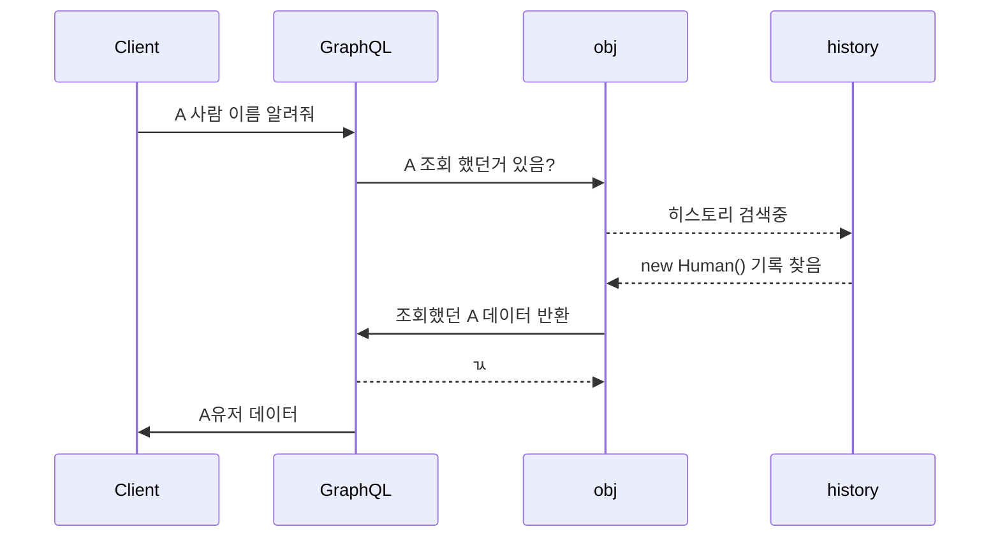

# 실행
 - 팁 : 타입 시스템을 이용하면 컴파일 타임에 에러를 발견할 수 있다. 
 - 검증과 관련하여 GraphQL에서 사용 가능한 케이스와 불가능한 케이스를 보자.


## 해당 페이지를 볼 때 알아두면 좋은 정보들

```typescript
type Query {
  human(id: ID!): Human
}

type Human {
  name: String
  appearsIn: [Episode]
  starships: [Starship]
}

enum Episode {
  NEWHOPE
  EMPIRE
  JEDI
}

type Starship {
  name: String
}
```


## 루트 필드 & resolvers

GraphQL의 `최상위 타입`은 서버에 진입점을 표현 해주는 타입들이며,
 `Root`타입과 `Query` 타입이라 부른다.
#### Resolver함수의 인자 
 - `obj` : 이전 객체. ( 대부분 사용되지 않은 `Root Query` )
 - `args` : GraphQL 쿼리 필드에 제공된 전달인자.
 - `context` : 모든 `resolver` 함수에 전달되며, 해당 context에는 db access값과 같은 값들이 저장될 수 있다. <br> 이는 언어마다 사용되는 범위가 다를 수 있을 것 같음. 
 - `info` : 현재 쿼리, 스키마 정보와 관련된 필드별 정보를 갖고 있는 값.  GraphQL에서 제공해주는 type을 사용할 수 있다.


#### 예제
```javascript
Query: {
  human(obj, args, context) {
    return context.db.loadHumanByID(args.id).then(
      userData => new Human(userData)
    )
  }
}
```
> 해당 resolver는 id를 받아 human 필드를 반환함. 

## 비동기 resolvers
각 언어마다 GraphQL을 지원하는 라이브러리마다 지원하는 비동기 라이브러리가 다름.
 - `javascript` : Promise
 - `Java, Js, etc..` : Futures
 - `C#, etc..` : Tasks
 - `Golang, C++, etc..` : Deferred


## 기본 resolvers
GraphQL 서버는 타입 시스템을 통해 작동되며, <br>이로 인하여 아래의 쿼리(`human`)가 실행되기 전에 GraphQL 시스템은 `Human`이 반환되는걸 미리 알고있음.
 ```javascript
Human: {
  name(obj, args, context) {
    return obj.name
  }
}
```
위의 Resolver는 다음과 같이 동작한다고 알 수 있습니다. 

> 위의 sequence diagram은 mermaid 라이브러리를 이용하여 만들어 졌으며, 코드는 다음과 같습니다.


## 스칼라 강제(`coercion`)
```javascript
Human: {
  appearsIn(obj) {
    return obj.appearsIn // returns [ 4, 5, 6 ]
  }
}
```
>  appearsIn은 `Episode` 타입을 반환하도록 명시 하였습니다.
>> `appearsIn:  [Episode]`
> 
> 하지만 위의 쿼리에서는 Episode대신 숫자를 반환 합니다.
> GraphQL은 타입 시스템을 사용하기 때문에 `Query`를 실행하기 전에 무엇을 반환하는지 알 수 있습니다
> 이 케이스에서, 만약 서버에서 `Episode`라는 `Enum` 타입이 4,5,6과 같은 `number`를 사용한다 할지라도, 
> GraphQL 시스템은 이를 열거형으로 표현합니다.


##  리스트 resolvers
```javascript
Human: {
  starships(obj, args, context) {
    return obj.starshipIDs.map(
      id => context.db.loadStarshipByID(id).then(
        shipData => new Starship(shipData)
      )
    )
  }
}
```
> `Promise`를 반환하는게 아니라, `list of Promise`를 반환함.
>  GraphQL은 모든 Promise를 기다릴 것이고 기다리는동안 다른 필드(ex `name`)를 로드할 수 있습니다.


## 결과 생성하기
결과는 다음과 같은 key-value 맵에 들어감
 - key : 결과값의 `필드 이름` or `별칭`
 - value : `resolve` 된 값.

해당 결과는 다음 순서로 동작함
> 쿼리의 끝 > 쿼리의 중간 > 루트